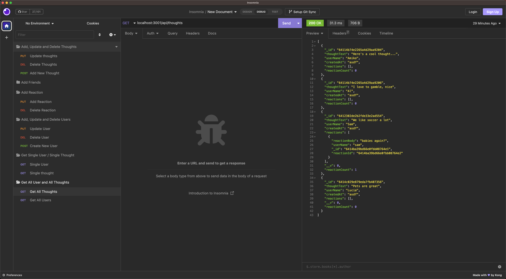

# Social Network Api

## User Story
As a social media startup, I want an api for my social network that uses a NoSQL database. So that my website can handle large amounts of unstructured data.

## Description
* You will need to use insomnia for this application. When the server starts, the mongoose models are synced to the MongoDB database. You can use get routes to get users and thoughs data. POST, PUT and DELETE routes are also available for adding friends to a user, adding reactions to a post and or deleting them.

## Table of Contents
- [Installation](#installation)
- [Usage](#usage)
- [How to Contribute](#how-to-contribute)
- [Questions](#questions)
- [License](#license)

## Installation
* In the root directory you want to run "npm i" to install all the required packages.

## Usage
* User can type "npm start" to start the node server. Or use "npm run dev" to use nodemon. To seed the data in the table you will want to run "npm run seed"

* This project uses monogoose, express and dayjs.

## License
* This project is under the MIT license.
* If you want to get more details about the license, please visit [Choose License](https://choosealicense.com "Choose License")

## How to Contribute
* Feel free to contact via email or github or fork my repo and request for pull request!

## Tests
* N/A

## Questions
* Please contact me via my [Github Username](https://github.com/johnxlai)

* You can reach me with additional questions <a href="mailto:lai.john.py@gmail.com">lai.john.py@gmail.com</a>

# Screenshot

## WalkThrough Video
https://drive.google.com/file/d/1C44gFf2sO2jV4oR0d-8h5hM0MwM11uvS/view
## Repo
https://github.com/johnxlai/social-network-api
